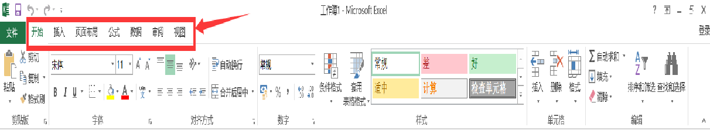

## 重点及难点：

- 重点：1、excel 软件基础界面

- 难点：1、excel按钮基础操作

## 认识EXCEL数据管家

Microsoft Excel是微软公司的办公软件Microsoft office的组件之一，是由Microsoft为Windows操作系统的电脑而编写和运行的一款试算表软件。Excel 是微软办公套装软件的一个重要的组成部分，它可以进行各种数据的处理、统计分析和辅助决策操作，广泛地应用于管理、统计财经、金融等众多领域。

## 单元格的基本操作

### 单元格的选取
  方法:鼠标拖动

> 小技巧： 不连续选取：按ctrl

### 选取行：

  单击行标签   

### 选取列：

  单击列标签

### 选取整张工作表：

  单击交叉处, shift

### 单元格数据的输入、修改与删除

  输入：在单元格中或编辑栏输入。

  修改：选中单元格，双击进行修改

  删除：选中单元格，按Delete 删除

### 特殊数据的输入

- 0开头的数字，ID号：“英文单引号+数字”如’001

- 输入日期：例：1月5日，输入“1/5”

- 分数：“0+空格+分数”；

- ★★★单元格内竖行换行，按Enter， 单元格内横行换行，按Tab。

### 插入、删除和隐藏行与列
  方法1：“开始”→“单元格” →“插入”
  方法2：右击行标签或列标签

### 调整行高与列宽
  方法1：鼠标拖动
  方法2：单击：“开始”→“单元格” →“格 式”→“行高/列宽”

### 合并单元格与取消合并  
  方法：单击功能区     “合并并居中”按扭

### 工作表的插入、删除、重命名、标签颜色的更改及工作表的隐藏
  方法1：单击：“开始”→“单元格” →“格式”→“工作表” 
  方法2：在工作表标签上右击

### 工作表的移动和复制

- 移动方法：拖动工作表标签
- 复制方法：按Ctrl键拖动工作表标签
