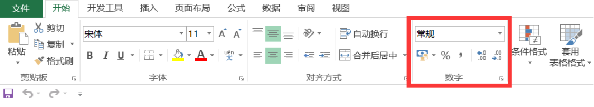
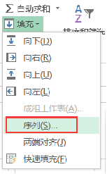
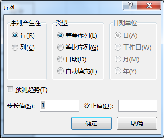
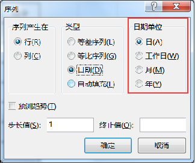
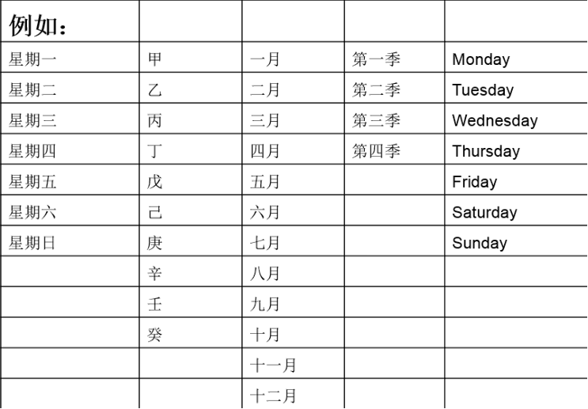

## 重点及难点
- 重点：
  - 单元格设置按钮
  - 单元格设置分类
  - 单元格设置数字选项卡
- 难点：
  - 数字选项卡内容

### 一、设置单元格格式

#### 怎么弹出单元格格式？
  - 点击数字格式右下方的小箭头
  - Ctrl+1

#### 1、数字选项卡

- 常规：不包括特定的数字格式

- 数值：用于一般的数字表示，保留小数位数

- 货币：可对一列数值进行货币符号和小数点对齐

- 会计专用：用于表示一般货币数值

- 日期：将日期和时间系列数值显示为日期值

- 百分比：将单元格数值乘以100，并以百分数形式显示

- 文本：在文本格式中，数字作为文本处理，单元格显示内容与输入内容完全一致。

#### 2、快捷方式
  开始选项卡 数字功能区 点击命令

### 二、自动填充数据

1、填充选项卡

- 序列
- 序列选项卡
- 等差序列
- 等比序列
- 日期
- 自动填充

点击【数据处理】功能区的【填充】右侧的小箭头
弹出框如下：

点击序列弹出框如下：

2、日期
- 日
- 工作日
- 月
- 年

点击【数据处理】功能区的【填充】右侧的小箭头

点击序列弹出框后点击类型【日期】即可点亮日期单位的选项：

### 作业：

### 总结：

1、单元格格式“数字”选项卡

2、自动填充内容（1）数字，（2）文本
