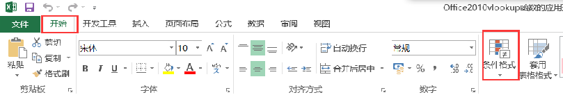
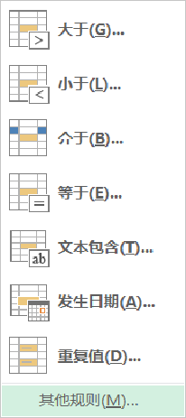
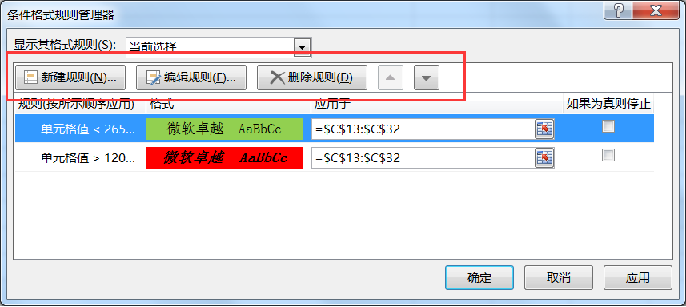

## 设置条件格式

- 重点：
  - 条件格式概述
  - 突出显示单元格规则
  - 清除规则
- 难点：
  - 条件格式规则管理器

### 一、设置条件格式
#### 1、条件格式概述
     其实质是为满足某种要求的数据加上特定的格式
#### 2、如何设置条件格式
  “开始”→“样式”→“条件格式”

#### 3、突出显示单元格规则内容：
- 大于
- 小于
- 介于
- 等于
- 文本包含
- 发生日期
- 重复值:1、重复2、唯一

#### 4、清除规则内容：
清除所选单元格的规则
清除整个工作表的规则

### 二、条件格式管理规则器
1、新建规则：
只为包含以下内容的单元格设置格式
编辑规则说明：
- 大于
- 小于
- 介于
- 等于
- 文本包含
- 发生日期
- 重复值

- 1、新建规则
- 2、编辑规则
- 3、删除规则
- 4、上移、下移

### 总结：
- 1、条件格式概述
- 2、突出显示单元格规则
- 3、清除规则
- 4、条件格式规则管理器
